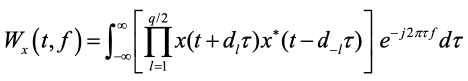
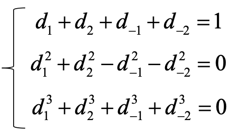
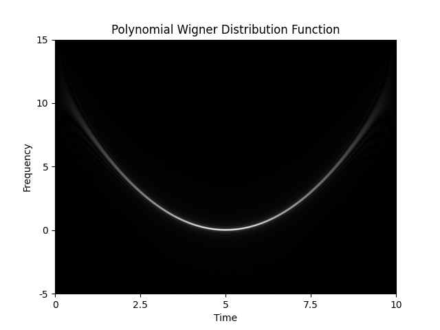

# Polynomial Wigner Distribution (q = 4)

C++ implementation of Polynomial Wigner Distribution (q = 4).

<p align="center"></p>

$d_1, d_2, d_{-1}, d_{-2}$ must satisfy



## Requirements

- CMake
- [FFTW](https://fftw.org/) version 3.3.10 (for 1D-FFT)
- [matplotlib-cpp](https://github.com/lava/matplotlib-cpp) (Download and save it in the `./include/` directory)
- Python, NumPy (for [matplotlib-cpp](https://github.com/lava/matplotlib-cpp))

## Usage

See `./src/main.cpp`

## Run

```bash
mkdir build
cd build
cmake ..
cmake --build . --config Release
./pwdf
```

## Example

The PWD of $x(t) = \exp(j(t-5)^3)$


